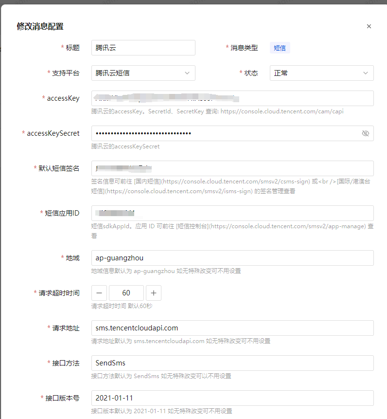
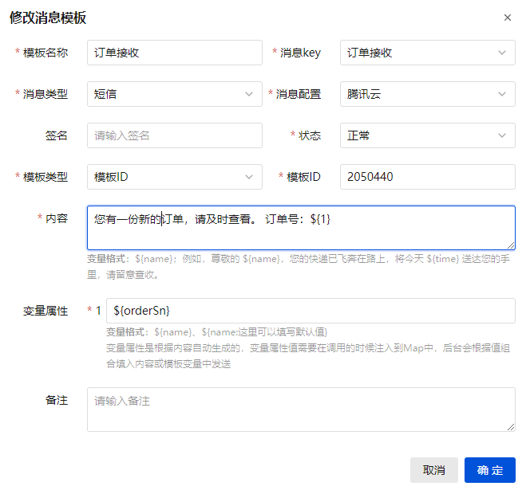

# 消息功能

## 功能配置

进入 `系统管理 -> 消息管理 -> 消息配置` 填写对应的消息配置



::: tip
此处可以配置多个消息配置，例如可以有多个不同的邮箱配置、短信配置。不同消息模板可以配置不同的消息配置。
:::

## 消息常量

进入 `系统管理 -> 消息管理 -> 消息常量` 填写需要发送的消息常量，一个消息常量对应多个消息模板<br/>
以下是一个发送短信验证码消息的示例：
```java{15}
@RestController
public class CaptchaController {

    /**
     * 短信验证码
     *
     * @param phonenumber 用户手机号
     */
    @RateLimiter(key = "#phonenumber", time = 60, count = 1)
    @GetMapping("/resource/sms/code")
    public R<Void> smsCode(@NotBlank(message = "{user.phonenumber.not.blank}") String phonenumber) {
        Map<String, Object> map = new HashMap<>(1);
        map.put("code", RandomUtil.randomNumbers(4));
        // 发送验证码
        messageSendService.send(MessageConstants.LOGIN_CAPTCHA, MessageTypeEnum.SMS, phonenumber, map);
        return R.ok();
    }
}
```

`MessageConstants.LOGIN_CAPTCHA` 就是此处的消息常量，此处发送一条登录验证码消息，类型是 `MessageTypeEnum.SMS` 短信平台

## 消息模板
进入 `系统管理 -> 消息管理 -> 消息模板` 填写不同平台的消息模板



例如这是一个新订单消息，使用的是腾讯短信平台。系统使用 `消息类型+消息key(消息常量)` 来作为唯一值，从而来确定应该使用哪条模板来发送消息。
### 消息key
选择在消息常量中创建的常量
### 消息类型
确定消息类型，也用来过滤消息配置
### 消息配置
消息平台配置，根据不同的类型选择不同的平台。
### 签名
消息模板中的签名可以覆盖配置中的签名
### 状态
只有正常状态才会被校验和发送
### 模板类型
模板类型分为 `模板内容` 与 `模板ID`，少部分短信平台支持发送短信内容但大部分平台只支持模板ID，而邮箱只支持模板内容模式。此处可根据平台自行选择
### 模板ID
模板类型为 `模板ID` 时，必填。
### 内容

**内容必填，而且应该根据实际意思填写。**

当模板类型为 `模板内容` 时，此处发送的就是实际渲染之后的字符串。当模板类型为 `模板ID`，实际发送的将是变量属性的值。

例如
```text
您有一份新的订单，请及时查看。 订单号：${1}
```
此时会自动生成一个变量属性 `1:${1}`。

第一个 `1` 是变量名称，也是实际会发送到短信平台的变量名称，在其他平台它可能会具有更有意义名字，例如：`code`。

第二个 `${1}` 是一个代码变量，由 `messageSendService.send(MessageConstants.LOGIN_CAPTCHA, MessageTypeEnum.SMS, phonenumber, map);` 中的map里面的key，因此这个名称你可以自由定义它。所以这里我将它重新命名为 `${orderSn}`。

此外，它并非只能声明一个代码变量，我们还可以给他赋值为 `${orderSn}-${timestamp}` 那么如果我的map中如果是这样的

```java
Map<String, Object> map = new HashMap<>(2);
map.put("orderSn", "123456");
map.put("timestamp", "1711092438431");
messageSendService.send(MessageConstants.ORDER_RECEIVE, MessageTypeEnum.SMS, phonenumber, map);
```

那么最终我们得到的将是 `1:123456-1711092438431`。很明显，此处的`1`由多个值组成，它更加地灵活，最终渲染后的字符串应该是

```text
您有一份新的订单，请及时查看。 订单号：123456-1711092438431
```

它的能力是由 `PropertyPlaceholderHelper` 提供的，实际上你还可以在map中放入一整个对象，使用 `${order.orderSn}` 的方式取值。

最终消息发送完成后，最终渲染后的字符串将记入到 `消息发送记录`


