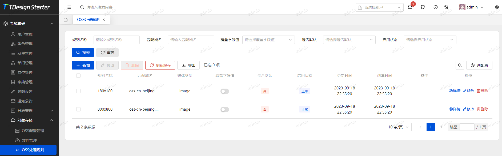
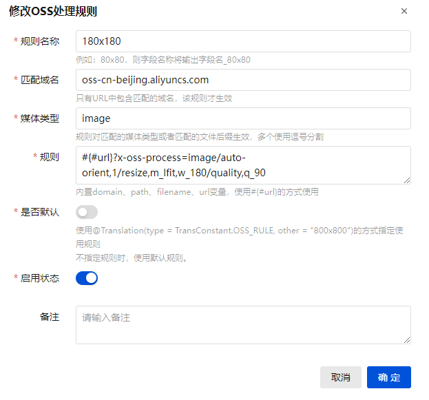

# OSS规则

## 简介
OSS规则是对文件回显的功能扩展，通过VO对象的注解声明，以及规则定义显示不同的图片规格或文件处理
::: tip
OSS规则是直接在url做修改，需要根据不同的厂商配置不同的规则
:::

## 创建规则
进入 `系统管理 -> 对象存储 -> OSS处理规则`





#### 规则名称

输出字段将使用该名称。例如：xxx.jpg -> xxx.jpg_80x80
#### 匹配域名

不同厂商具有不同的图片处理规则，因此可以创建多个相同名称的规则来适配不同厂商带来的变化。例如阿里云OSS对象存储使用 `url?x-oss-process=image/auto-orient,1/resize,m_lfit,w_180/quality,q_90` 来指定使用宽度80高度自适应的图片输出格式
#### 媒体类型

只有指定的媒体类型才使用规则，其他类型不做处理，多个媒体类型使用逗号进行分割。例如图片 `image/png,image/jpg`
#### 规则

内置domain、path、filename、url变量，使用#{#url}的方式使用。<br/>例如url为：https://ruoyi-tdesign.oss-cn-hangzhou.aliyuncs.com/2024/03/18/fd623a4b99824cbb8aa6cf289b513adb.png
* domain:`https://ruoyi-tdesign.oss-cn-hangzhou.aliyuncs.com`
* path:`2024/03/18`
* filename:`fd623a4b99824cbb8aa6cf289b513adb.png`
* url：`https://ruoyi-tdesign.oss-cn-hangzhou.aliyuncs.com/2024/03/18/fd623a4b99824cbb8aa6cf289b513adb.png`
#### 是否默认

不指定规则时，使用该规则
#### 启用状态

未启用则不生效

::: tip
* 媒体类型针对url的文件后缀自动生成，因此应该考虑上传时使用正确的后缀名称。
* 自 `1.2.0` 之后的版本支持将id自动转为url
:::

## 使用方式

使用默认规则
::: code-group
```java [java <Badge type="tip" text=">1.2.0" />]
public class POJO {
    @OssRule
    private String url;
}
```
```java [java <Badge type="tip" text="<=1.2.0" />]
public class POJO {
    @Translation(type = TransConstant.OSS_RULE)
    private String url;
}
```
```vue [Vue]
<image-preview :src="row.url" width="60px" height="60px"/>
```
:::


使用指定规则
::: code-group
```java [java <Badge type="tip" text=">1.2.0" />]
public class POJO {
    @OssRule("80x80")
    private String url;
}
```
```java [java <Badge type="tip" text="<=1.2.0" />]
public class POJO {
    @Translation(type = TransConstant.OSS_RULE, other = "80x80")
    private String url;
}
```
```vue [Vue]
<image-preview :src="row.url_80x80" width="60px" height="60px"/>
```
:::

::: tip
自 `1.2.0` 之后的版本将使用 `@OssRule` 注解替代 `@Translation(type = TransConstant.OSS_RULE)`，同时提供一些更高级的用法
:::

`OssRule` 的定义：

```java
@Inherited
@Retention(RetentionPolicy.RUNTIME)
@Target({ElementType.FIELD, ElementType.METHOD})
@Documented
@JacksonAnnotationsInside
@JsonSerialize(using = OssRuleHandler.class)
public @interface OssRule {

    /**
     * 使用指定的规则
     */
    String[] value() default {};

    /**
     * 指定规则时，是否使用默认规则。
     * <p>{@link OssRule#value}不存在时，即使是false也将使用默认规则
     */
    boolean useDefault() default false;

    /**
     * 字段与规则的连接符
     */
    String join() default "_";

    /**
     * 映射字段 (如果不为空则取此字段的值)
     */
    String mapper() default "";

    /**
     * 包装方式
     */
    PackingMethod packingMethod() default PackingMethod.UNWRAPPED;

    /**
     * 包装名称。
     * 包装方式为{@link PackingMethod#WRAPPED}时，值将包装在该字段中
     * 字段包装规则：fieldName + wrapName()
     */
    String wrapName() default "Wrap";

    /**
     * 包装方式
     */
    enum PackingMethod {
        /** 包装。将url包装到同一个字段中 */
        WRAPPED,
        /** 不包装。直接在列表中展示 */
        UNWRAPPED
    }
}
```

**包装方式影响最终输出的字段类型值**

未包装
```json
{
  "url": "https://ruoyi-tdesign.oss-cn-hangzhou.aliyuncs.com/2024/03/18/fd623a4b99824cbb8aa6cf289b513adb.png",
  "url_180x180": "https://ruoyi-tdesign.oss-cn-hangzhou.aliyuncs.com/2024/03/18/fd623a4b99824cbb8aa6cf289b513adb.png?x-oss-process=image/auto-orient,1/resize,m_lfit,w_180/quality,q_90"
}
```

包装后
```json
{
  "url": "https://ruoyi-tdesign.oss-cn-hangzhou.aliyuncs.com/2024/03/18/fd623a4b99824cbb8aa6cf289b513adb.png",
  "urlWrap": {
    "url": "https://ruoyi-tdesign.oss-cn-hangzhou.aliyuncs.com/2024/03/18/fd623a4b99824cbb8aa6cf289b513adb.png",
    "url_180x180": "https://ruoyi-tdesign.oss-cn-hangzhou.aliyuncs.com/2024/03/18/fd623a4b99824cbb8aa6cf289b513adb.png?x-oss-process=image/auto-orient,1/resize,m_lfit,w_180/quality,q_90"
  }
}
```
