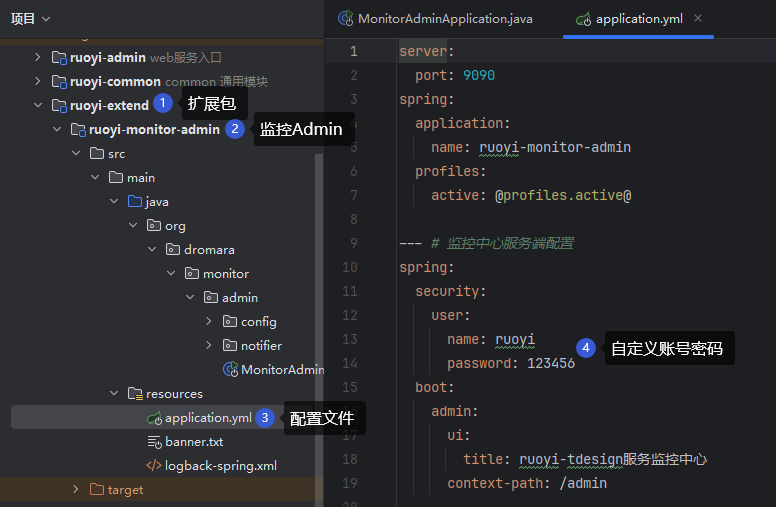
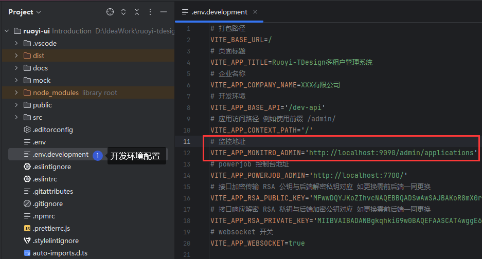
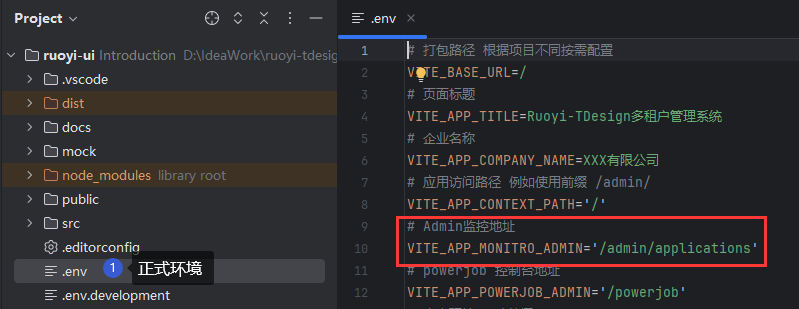

# 搭建Admin监控

## 配置监控客户端

> 修改主服务配置文件 `ruoyi-admin/src/main/resources/application-dev.yml`

```yaml
--- # 监控中心配置
spring.boot.admin.client:
  # 增加客户端开关
  enabled: true
  url: http://localhost:9090/admin
  instance:
    service-host-type: IP
  username: ruoyi
  password: 123456
```

* `enabled` 可启用或关闭客户端注册
* `url` 为监控中心地址
* `username 与 password` 为监控中心的账号密码

## 启用监控中心
在 `扩展项目 -> 监控模块` 启动 <br>
在监控模块对应的 `yml` 配置文件 可设置登录的账号密码与访问路径



## 前端修改admin监控访问路径
`dev`环境 默认使用 `.env.development` 配置文件内地址



`prod`环境 使用 `.env.production` 本机路由



故而 `prod` 环境只需更改 `nginx` 反向代理路径即可 <br>
打开文件： `script/docker/nginx/conf/nginx.conf`

```nginx configuration
http {
    # 负载均衡，如不需要，可直接替换到以下地址中
    upstream monitor-admin {
        server 127.0.0.1:9090;
    }

    server {
        # https 会拦截内链所有的 http 请求 造成功能无法使用
        # 解决方案1 将 admin 服务 也配置成 https
        # 解决方案2 将菜单配置为外链访问 走独立页面 http 访问
        location ^~ /admin/ {
            proxy_set_header Host $http_host;
            proxy_set_header X-Real-IP $remote_addr;
            proxy_set_header REMOTE-HOST $remote_addr;
            proxy_set_header X-Forwarded-For $proxy_add_x_forwarded_for;
            proxy_pass http://monitor-admin/admin/; #使用负载均衡地址
        }
    }
}
```
