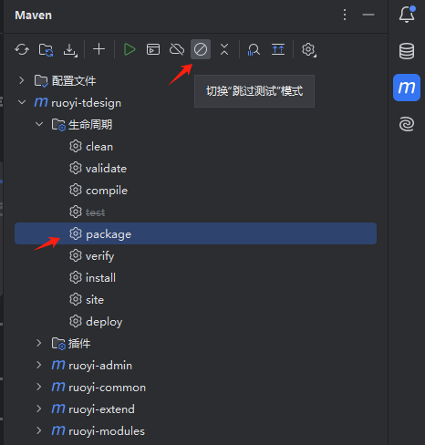
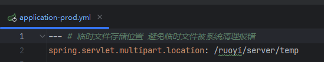
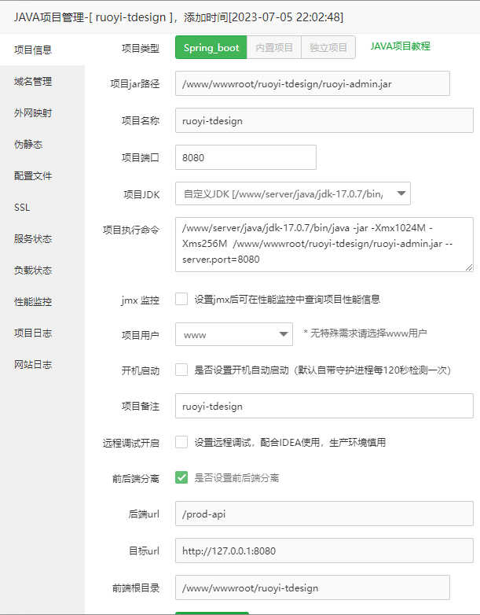

# 在Linux中手动部署

::: tip
部署前打包jar前，请确保切换到生产环境中。[生产环境切换](./environment-switching.md)
:::

在服务器安装 `OpenJdk17` `mysql`、`redis`、`nginx`、`minio(可选)`

## 软件介绍
OpenJdk: java运行环境

mysql: 数据库

redis: 高速缓存、分布式内存存储

nginx: 反向代理

minio: 对象存储（文件存储）

## 编译
将项目内 `script/docker/nginx/nginx.conf` 配置文件 复制到 `nginx` 配置内

将项目内 `script/docker/redis/redis.conf` 配置文件 复制到 `redis` 配置内

并修改相关参数如 `前端页面存放位置` `后端Ip地址` 等使其生效

若使用SSL协议需要自行修改证书路径

jar包部署后端服务 打包命令如下

3.2.0及以上

```shell
mvn clean package -D maven.test.skip=true -P prod
```
::: tip 提示
IntelliJ IDEA软件可以使用maven侧边栏按钮打包。配置文件需要切换到 `prod` 模式下

:::

服务器需创建临时文件存储目录与配置文件对应(无此目录上传文件会报错)


## 运行
将编译完成的文件 `target/ruoyi-admin.jar` 上传到Linux服务器端。 

### 1.使用java命令运行jar
```shell
nohup /www/server/java/jdk-17.0.8/bin/java -jar -Xmx1024M -Xms1024M /www/ruoyi-tdesign/ruoyi-admin.jar >/dev/null &
```
::: tip 提示
`/www/server/java/jdk-17.0.8/bin/java` 是jdk安装位置  
`/www/ruoyi-tdesign/ruoyi-admin.jar` 是jar包存放位置
:::
### 2.使用宝塔运行
在 `网站 > Java项目 > 添加Java项目 > Spring_boot` 中填写具体信息


如使用admin项目，则需要勾选`前后端分离`

nginx配置参考：
```nginx
server
{
    listen 80;
    listen 443 ssl http2;
    server_name ruoyi-tdesign.hexm.online;
    index index.html index.htm default.htm default.html;
    root /www/wwwroot/ruoyi-tdesign;

    #SSL-START SSL相关配置
    #error_page 404/404.html;
    #HTTP_TO_HTTPS_START
    if ($server_port !~ 443){
        rewrite ^(/.*)$ https://$host$1 permanent;
    }
    #HTTP_TO_HTTPS_END
    ssl_certificate    /www/server/panel/vhost/cert/ruoyi-tdesign/fullchain.pem;
    ssl_certificate_key    /www/server/panel/vhost/cert/ruoyi-tdesign/privkey.pem;
    ssl_protocols TLSv1.1 TLSv1.2 TLSv1.3;
    ssl_ciphers EECDH+CHACHA20:EECDH+CHACHA20-draft:EECDH+AES128:RSA+AES128:EECDH+AES256:RSA+AES256:EECDH+3DES:RSA+3DES:!MD5;
    ssl_prefer_server_ciphers on;
    ssl_session_cache shared:SSL:10m;
    ssl_session_timeout 10m;
    add_header Strict-Transport-Security "max-age=31536000";
    error_page 497  https://$host$request_uri;

    #REWRITE-START 伪静态相关配置
    include /www/server/panel/vhost/rewrite/java_ruoyi-tdesign.conf;
    #REWRITE-END

    #禁止访问的文件或目录
    location ~ ^/(\.user.ini|\.htaccess|\.git|\.svn|\.project|LICENSE|README.md|package.json|package-lock.json|\.env) {
        return 404;
    }

    #一键申请SSL证书验证目录相关设置
    location /.well-known/ {
        root /www/wwwroot/java_node_ssl;
    }

    #禁止在证书验证目录放入敏感文件
    if ( $uri ~ "^/\.well-known/.*\.(php|jsp|py|js|css|lua|ts|go|zip|tar\.gz|rar|7z|sql|bak)$" ) {
        return 403;
    }


    # HTTP反向代理相关配置开始 >>>
    location ~ /purge(/.*) {
        proxy_cache_purge cache_one $Host$request_uri$is_args$args;
    }
    
    # 限制外网访问内网 actuator 相关路径
    location ~ ^(/[^/]*)?/actuator(/.*)?$ {
        return 403;
    }
    
    location / {
        root   /www/wwwroot/ruoyi-tdesign/html/admin;
        try_files $uri $uri/ /index.html;
        index  index.html index.htm;
    }

    location ^~ /prod-api/ {
        proxy_pass http://127.0.0.1:8080/;
        proxy_set_header Host $Host:$server_port;
        proxy_set_header X-Real-IP $remote_addr;
        proxy_set_header X-Forwarded-For $proxy_add_x_forwarded_for;
        proxy_set_header REMOTE-HOST $remote_addr;
        add_header X-Cache $upstream_cache_status;
        proxy_set_header X-Host $host:$server_port;
        proxy_set_header X-Scheme $scheme;
        proxy_connect_timeout 30s;
        proxy_read_timeout 86400s;
        proxy_send_timeout 30s;
        # 支持websocket
        proxy_http_version 1.1;
        proxy_set_header Upgrade $http_upgrade;
        proxy_set_header Connection "upgrade";
    }
    # HTTP反向代理相关配置结束 <<<

    access_log  /www/wwwlogs/ruoyi-tdesign.log;
    error_log  /www/wwwlogs/ruoyi-tdesign.error.log;
}
```
