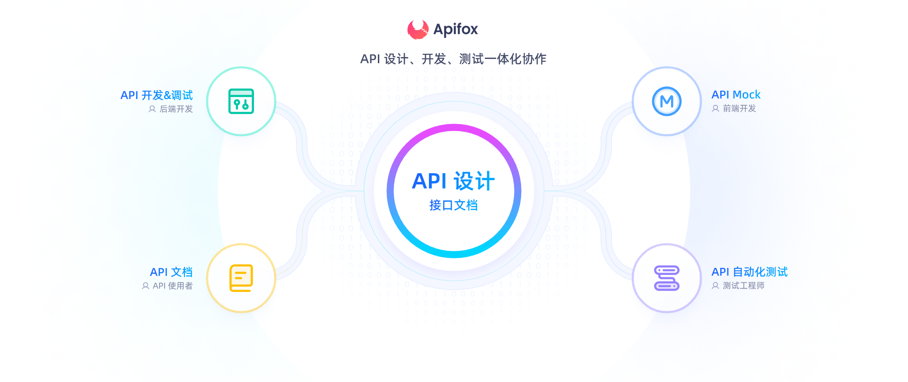
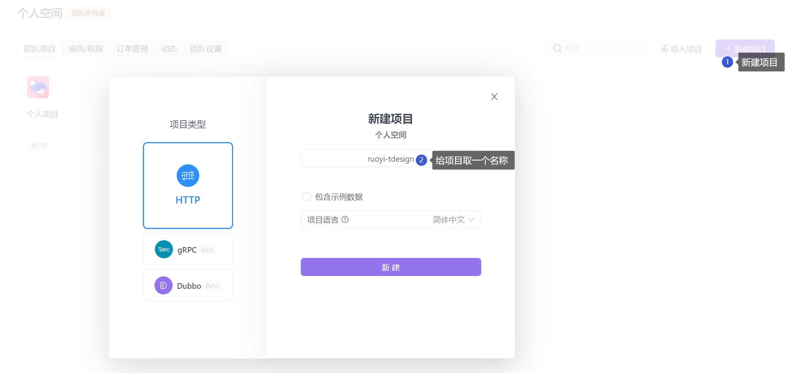
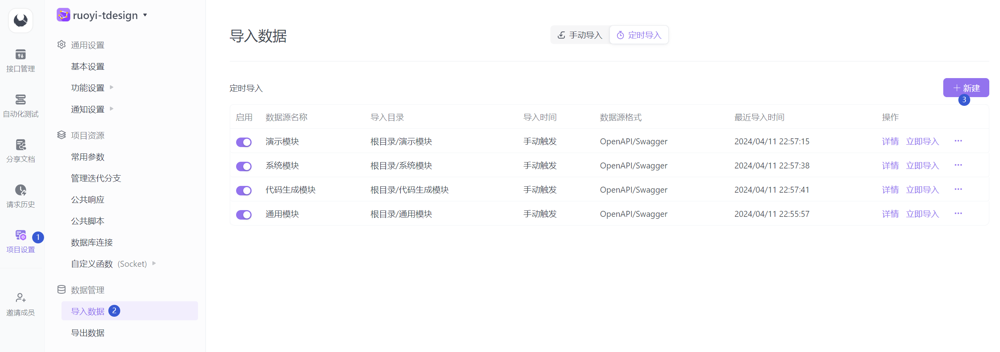
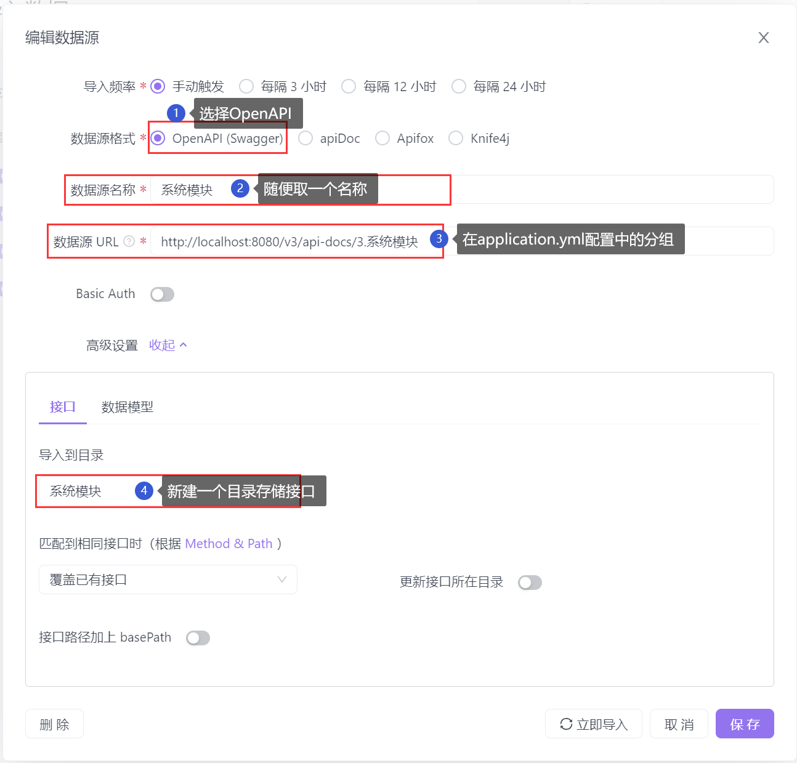
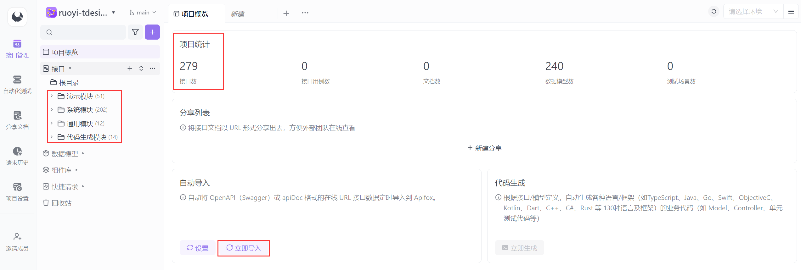
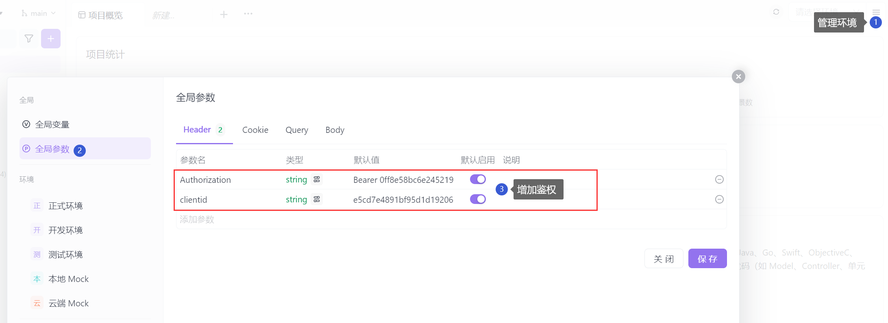

# Api接口文档

`springdoc` 框架，基于 `javadoc` 无注解零入侵生成规范的 `openapi` 结构体 <br>
由于框架自带文档UI功能单一扩展性差 故移除自带UI 建议使用外置文档工具

## 文档工具使用
由于框架采用 `openapi` 行业规范 故市面上大部分的框架均支持 可自行选择 <br>
例如: `apifox` `apipost` `postman` `torna` `knife4j` 等 根据对应工具的文档接入即可

## Swagger升级SpringDoc指南

常见功能如下 其他功能自行挖掘 <br>
**注意: `javadoc` 只能替换基础功能 特殊功能还需要使用注解实现**

| swagger                          | springdoc                       | javadoc            |
|----------------------------------|---------------------------------|--------------------|
| @Api(name = "xxx")               | @Tag(name = "xxx")              | java类注释第一行         |
| @Api(description= "xxx")         | @Tag(description= "xxx")        | java类注释            |
| @ApiOperation                    | @Operation                      | java方法注释           | 
| @ApiIgnore                       | @Hidden                         | 无                  | 
| @ApiParam                        | @Parameter                      | java方法@param参数注释   | 
| @ApiImplicitParam                | @Parameter                      | java方法@param参数注释   | 
| @ApiImplicitParams               | @Parameters                     | 多个@param参数注释       | 
| @ApiModel                        | @Schema                         | java实体类注释          | 
| @ApiModelProperty                | @Schema                         | java属性注释           | 
| @ApiModelProperty(hidden = true) | @Schema(accessMode = READ_ONLY) | 无                  | 
| @ApiResponse                     | @ApiResponse                    | java方法@return返回值注释 | 

# 建议使用 `Apifox`(常见问题有其他对接方式)

官网连接: [https://www.apifox.cn/](https://www.apifox.cn/) <br>
视频教程: [springdoc与apifox配合使用](https://www.bilibili.com/video/BV1mr4y1j75M?p=8&vd_source=8f52c77be3233dbdd1c5e332d4d45bfb)


支持 文档编写 接口调试 Mock 接口压测 自动化测试 等一系列功能

### 接入框架

### 1.下载或使用web在线版 创建一个自己的项目



### 2.进入项目 选择项目设置 选择导入数据 找到定时导入



### 3.根据项目内所有文档组完成所有数据源创建(拉取后端`openapi`结构体)<br>
数据源URL格式 `http://后端ip:端口/v3/api-docs/组名`<br>
项目内所需:<br>
`http://localhost:8080/v3/api-docs/1.演示模块` <br>
`http://localhost:8080/v3/api-docs/2.通用模块` <br>
`http://localhost:8080/v3/api-docs/3.系统模块` <br>
`http://localhost:8080/v3/api-docs/4.代码生成模块` <br>
也可不分组统一导入: `http://localhost:8080/v3/api-docs` <br>



application.yml 文件
```yaml
# api地址(数据源URL)：http://localhost:8080/v3/api-docs/1.演示模块
springdoc:
  api-docs:
    # 是否开启接口文档
    enabled: true
  #这里定义了两个分组，可定义多个，也可以不定义
  group-configs:
    - group: 1.演示模块
      packages-to-scan: org.dromara.demo
    - group: 2.通用模块
      packages-to-scan: org.dromara.web
    - group: 3.系统模块
      packages-to-scan: org.dromara.system
    - group: 4.代码生成模块
      packages-to-scan: org.dromara.generator
```


> 4.选择 接口管理 项目概览 点击立即导入 并等待导入完成<br>
后续会根据策略每3个小时自动导入一次<br>
每次重新进入apifox也会自动同步一次<br>
后端有改动也可以手动点击导入<br>



> 5.设置鉴权 选择接口管理 项目概览 找到Auth 按照如下配置



> key对应项目配置 默认为 `Authorization`

```yaml {6,15}
# Sa-Token配置
sa-token:
  multiple:
    login:
      # token名称 (同时也是cookie名称)
      token-name: Authorization
# api地址(数据源URL)：http://localhost:8080/v3/api-docs/1.演示模块
springdoc:
  components:
    # 鉴权方式配置
    security-schemes:
      apiKey:
        type: APIKEY
        in: HEADER
        name: ${sa-token.token-name}
```

