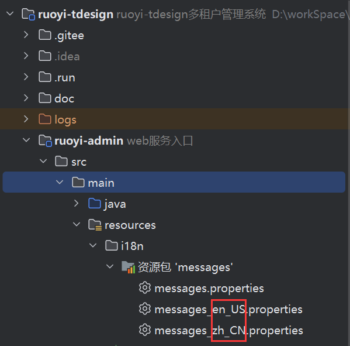
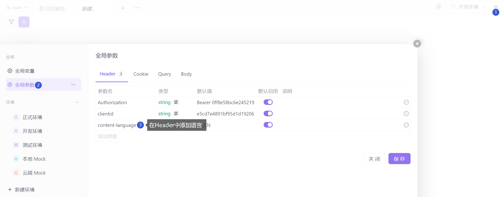
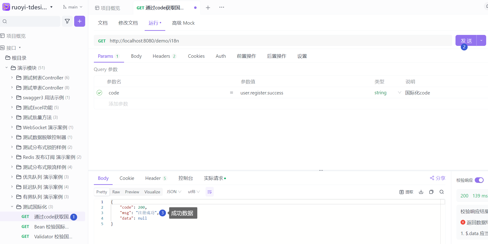
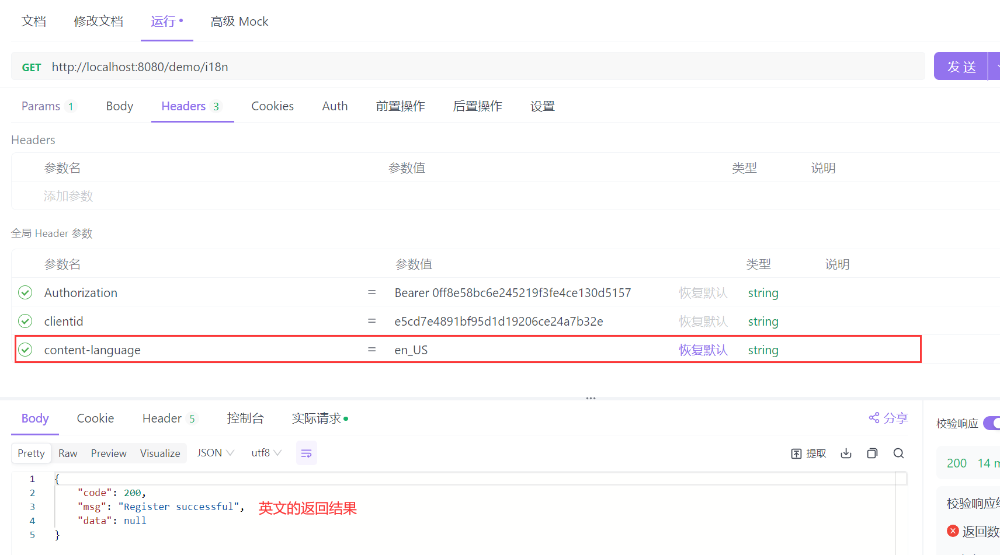

# 国际化方案

* 前端国际化参考 [ruoyi前端国际化文档](http://doc.ruoyi.vip/ruoyi-vue/document/htsc.html#前端国际化流程)<br>
* 后端国际化(2.7.0 以上增加)
* 3.4.0 以上支持 `Validator` 校验框架
* 参考 `demo` 模块 `TestI18nController` 国际化演示案例
  在 `Header` 请求头 增加上下文语言参数 `content-language` 参数需与国际化配置文件后缀对应
  如 `zh_CN` `en_US` 等<br>



## 获取 `code` 对应国际化内容







## 使用 `Validator` 框架校验 `controller` 参数返回国际化

`controller` 校验接口参数 需要在类增加 `@Validated` 注解<br>
参数对应校验注解 使用 `{code}` 形式标注使用国际化处理<br>

```java {6,18}
/**
 * 测试国际化
 *
 * @author Lion Li
 */
@Validated
@RestController
@RequestMapping("/demo/i18n")
public class TestI18nController {

    /**
     * Validator 校验国际化
     * 不传值 分别查看异常返回
     * <p>
     * 测试使用 not.null
     */
    @GetMapping("/test1")
    public R<Void> test1(@NotBlank(message = "{not.null}") String str) {
        return R.msg(str);
    }

}
```

## 使用 `Validator` 框架校验 `Bean` 返回国际化

`Bean` 校验需要在接口校验 `Bean` 参数使用 `@Validated` 注解<br>
`Bean` 内属性校验注解 使用 `{code}` 形式标注使用国际化处理<br>

```java {18,25,28-29}
/**
 * 测试国际化
 *
 * @author Lion Li
 */
@Validated
@RestController
@RequestMapping("/demo/i18n")
public class TestI18nController {

    /**
     * Bean 校验国际化
     * 不传值 分别查看异常返回
     * <p>
     * 测试使用 not.null
     */
    @GetMapping("/test2")
    public R<TestI18nBo> test2(@Validated TestI18nBo bo) {
        return R.ok(bo);
    }

    @Data
    public static class TestI18nBo {

        @NotBlank(message = "{not.null}")
        private String name;

        @NotNull(message = "{not.null}")
        @Range(min = 0, max = 100, message = "{length.not.valid}")
        private Integer age;
    }
}
```
