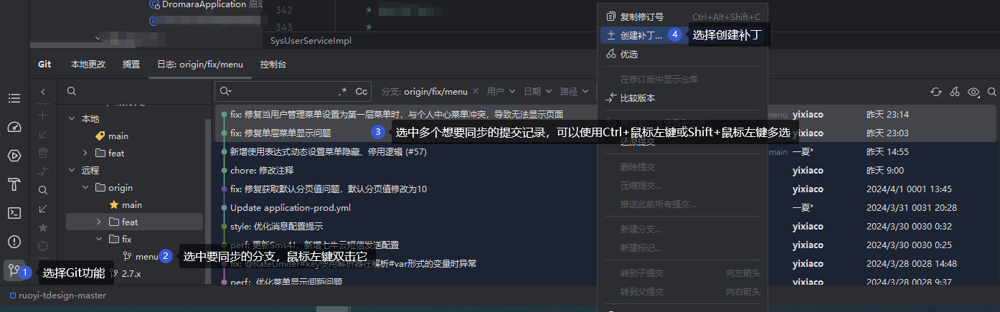
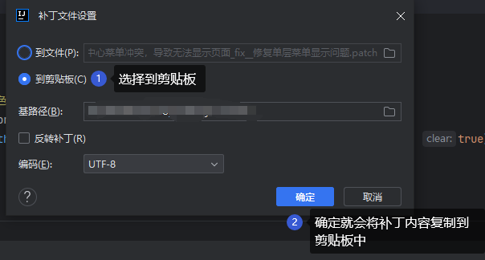
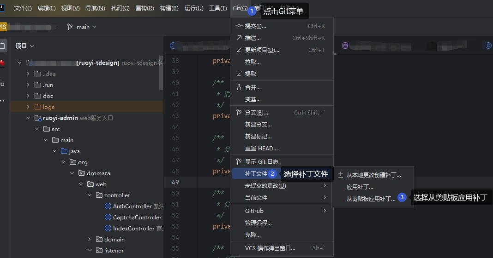
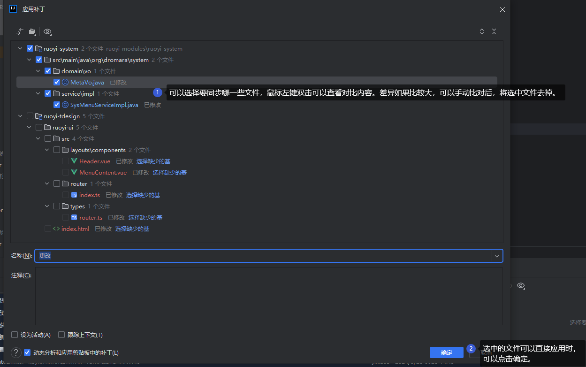
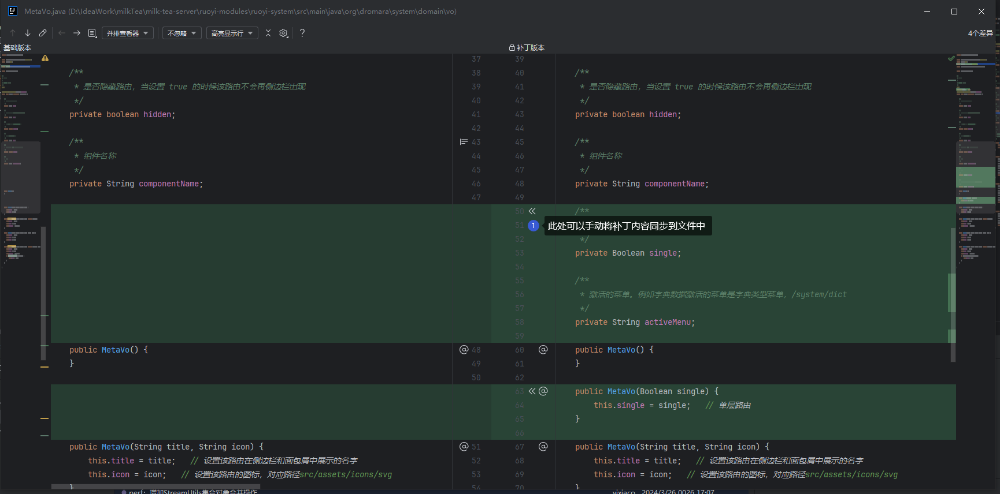

# IDEA使用Git技巧

## 如何快速同步框架代码

### 复制补丁内容

**步骤：**
1. 选择Git功能
2. 选中要同步的分支，鼠标左键双击它
3. 选中多个想要同步的提交记录，可以使用Ctrl+鼠标左键或者Shift+鼠标左键多选
4. 在选中的提交记录上单击鼠标右键，会弹出选择创建补丁
5. 选择到剪贴板。然后点击确定就会将补丁内容复制到剪贴板中

### 应用补丁

::: warning 注意事项
为了防止同步过程差异过大，中止回滚同步时会导致本地未提交的代码一起被回滚，请确保已经将本地代码提交!!! (可以无需推送到远程)
:::

**步骤：**
1. 点击Git菜单
2. 选择补丁文件
3. 选择从剪贴板应用补丁
4. 可以选择要同步哪一些文件，鼠标左键双击可以查看对比内容。差异如果比较大，可以手动比对后，将选中文件去掉。
5. 选中的文件可以直接应用时，可以点击确定。

> 如果是手动比较（该步骤不是必须的）：

