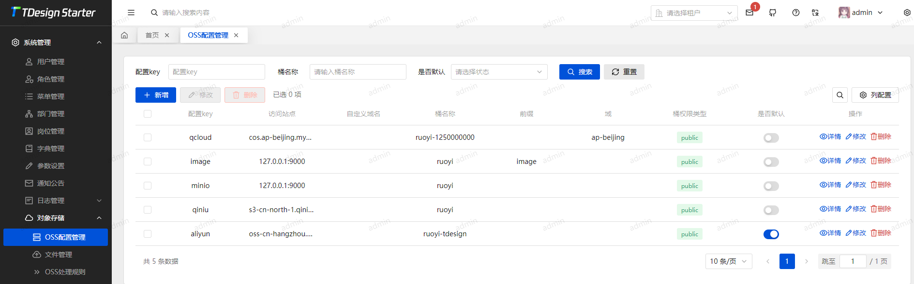
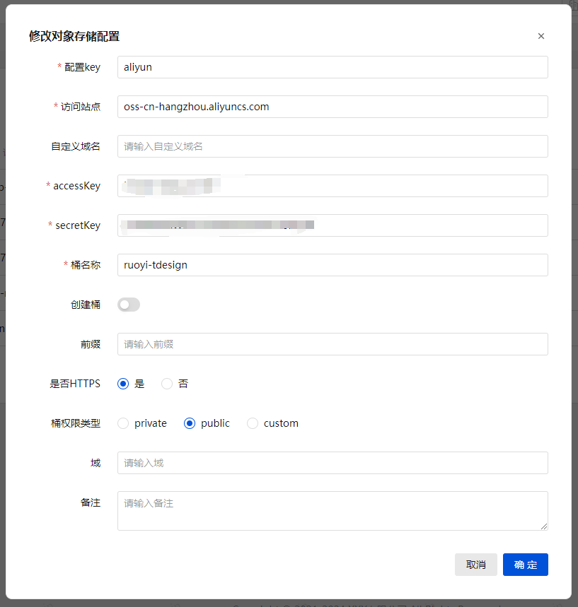
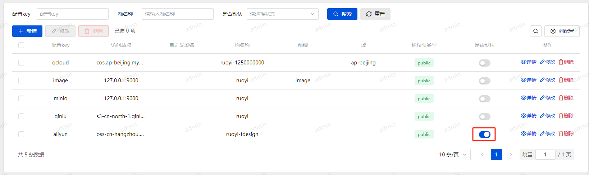
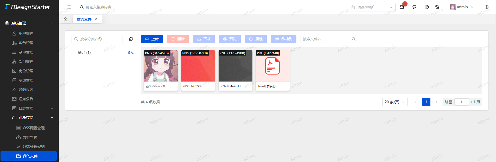

# OSS功能

## 重点注意事项
`桶/存储区域` 系统会根据配置自行创建分配权限 
支持配置`公有/私有`权限(`aliyun` 还需开通跨域配置) 
访问站点 后严禁携带其他 `url` 例如: `/`, `/ruoyi` 等 
**阿里云与腾讯云SDK访问站点中不能包含桶名 系统会自动处理** 
**minio 站点不允许使用 localhost 请使用 127.0.0.1** 
**访问站点与自定义域名 都不要包含 `http` `https` 前缀 设置`https`请使用选项处理** 

## 代码使用
参考 `SysOssService.upload` 用法 
使用 `OssFactory.instance()` 获取当前启用的 `OssClient` 实例 
进行功能调用 获取返回值后 存储到对应的业务表

## 功能配置
### 配置OSS

进入 `系统管理 -> 对象存储 -> OSS配置管理` 填写对应的OSS服务相关配置

::: tip
云厂商只需修改 `访问站点` 对应的域 切勿乱改(云厂商强烈建议绑定自定义域名使用 七牛云必须绑定[官方规定])
:::

### 切换OSS

> 再配置列表点击 `状态` 按钮开启即可(注意: 只能开启一个OSS默认配置) 
> 手动使用 `OssFactory.instance("configKey")`

### 上传图片或文件
进入 `系统管理 -> 对象存储 -> 文件管理` 点击 `上传文件` 或 `上传图片` 根据选项选择即可 
会对应上传到配置开启的OSS内
::: danger 警告
`文件删除`会将云服务中删除指定的文件，将导致所有引用了该文件的无法访问，请谨慎操作
:::

## 我的文件
进入 `系统管理 -> 对象存储 -> 我的文件`

`文件管理` 与 `我的文件` 的区别： 
1. 在 `我的文件` 中每个用户将只能看到自己上传的文件
2. 支持文件分类
3. 支持文件上锁/解锁

使用场景：非管理员操作管理自己上传的文件

**快捷键**： 
`Ctrl + 鼠标左键`（多选）: 未选中的文件附加到已选文件中、或者将已选文件改为未选中的文件 
`Shift + 鼠标左键`（多选）: 文件从第一个选择到最后点击的文件 
`Ctrl + Shift + 鼠标左键`（多选）: 附加到选中的文件中，文件从第一个选择到最后点击的文件 
`鼠标左键双击`: 快速修改文件 

`ruoyi-ui` 中，`文件上传`和`图片上传`默认使用我的文件管理
