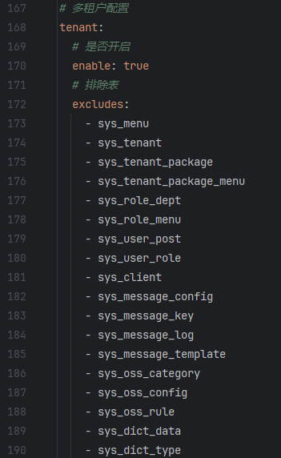
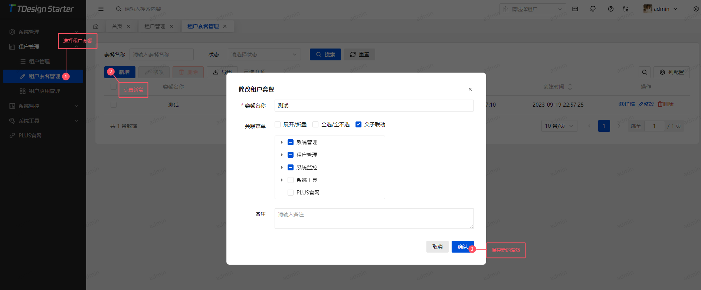
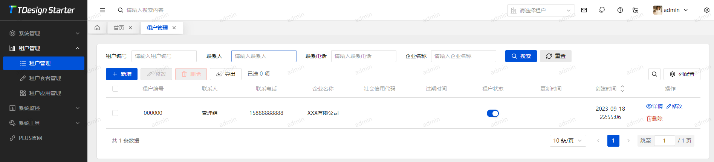
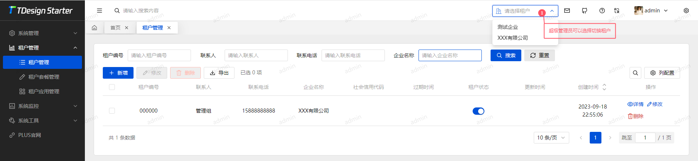
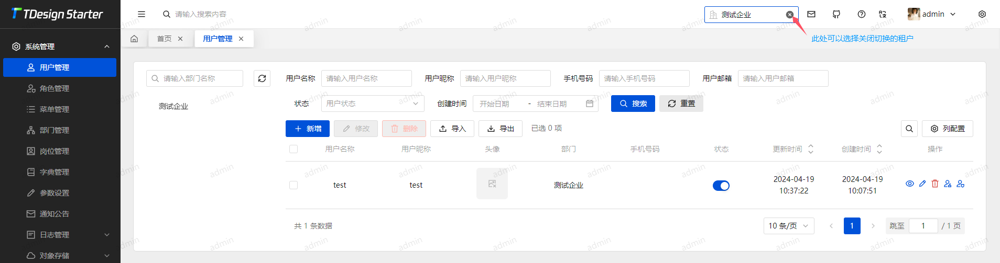

# 多租户功能 <Badge type="tip" text="v1.0.4" />

## 前置说明（重要）
1. 本框架多租户功能的实现是基于 [MyBatis-Plus 多租户插件](https://baomidou.com/plugins/tenant/) 的，只支持最简单的隔离。
2. 本系统默认开启多租户功能。
3. 多租户业务表建表需要加上租户id `tenant_id`，可参考其他系统表。
4. 非多租户表可在配置文件进行配置排除。
5. 只有超级管理员支持切换租户。

## 多租户使用流程（先说结论再展开！）
1. 开启多租户配置（系统默认已经开启）
2. 登录界面（不同租户下的登录账号唯一、手机号唯一、邮箱唯一，因此可以自动识别登录账号的租户）
3. 设置多租户套餐
4. 新增/修改租户（需要选择套餐）
5. 切换租户（仅超级管理员可操作）

## 多租户配置
`application.yml`<br>

> 开关 `enable` 节点不用废话。 <br>
> 如果不需要过滤租户的表可在 `excludes` 节点下添加。

**注意: 如果已经基于租户模式启动了程序 关闭租户必须删除mysql与redis内的相关数据重新导入sql**



## 忽略租户

1.如果需要指定单独 SQL 不开启过滤，可在对应的 Mapper 接口添加如下忽略注解：
```java
@InterceptorIgnore(tenantLine = "true", dataPermission = "false")
```
**此处注意事项 使用此注解如果需要开启数据权限 dataPermission = "false" 必须添加 mp的注解默认是忽略数据权限的 会导致数据权限失效**

2.如果需要在业务层忽略多租户，可调用以下方法(推荐使用)：
```java
// 无返回值
TenantHelper.ignore(() -> { /*业务代码*/ });
// 有返回值
Class result = TenantHelper.ignore(() -> { return /*业务代码*/ });
```

3.使用注解忽略多租户
```java
@Component
public class Test {

  @IgnoreTenant
  public void test() {}

}
```

## 动态切换租户

**仅适用于特殊需求业务(例如: 创建租户时, 对该租户操作一些数据, 或者需要去其他租户查一些数据等) 禁止乱用后果自负**

* 使用方法动态切换租户
```java
// 无返回值
TenantHelper.dynamicTenant(租户id, () -> { /*业务代码*/ });
// 有返回值
Class result = TenantHelper.dynamicTenant(租户id, () -> { return /*业务代码*/ });
```
* 使用注解动态切换租户
```java
@Component
public class BizTest {

    // 1.2.0及以下版本请使用 #{#tenantId} 写法
    @DynamicTenant(value  = "#tenantId")
    public void test(String tenantId) {
        // 业务代码
    }
}
```

## 租户套餐管理
### 租户套餐新增


> 注：
> 1、先新增套餐再新增租户，因为租户新增之后无法修改所选套餐。
> 2、租户所关联的套餐修改后会自动同步。


## 租户管理
### 默认租户
> 注：默认租户无法修改



## 切换租户（仅超级管理员）
> 注：管理员切换租户不是切换用户，切换的只是数据，管理员拥有所有权限。





