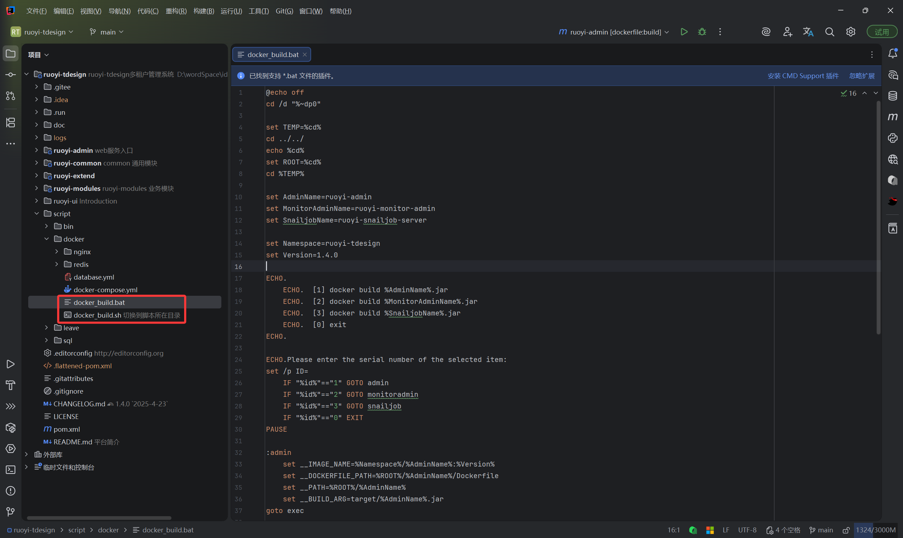
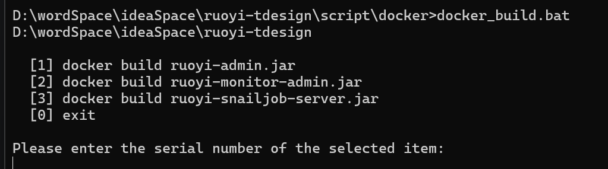
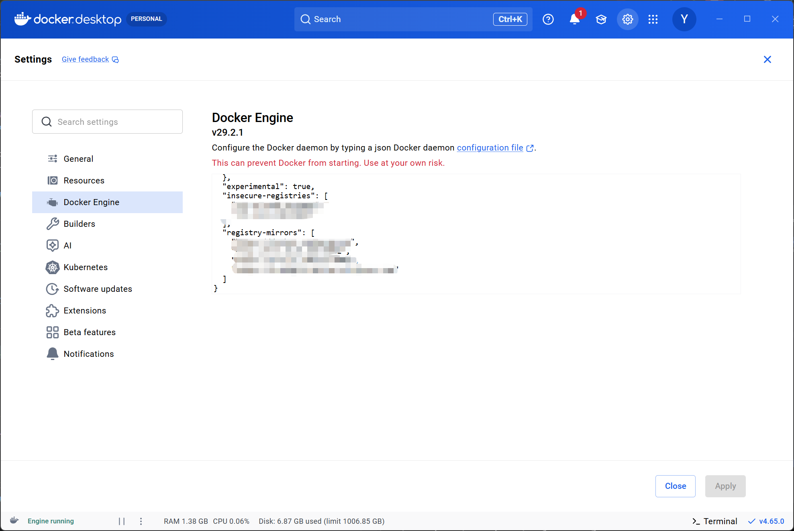
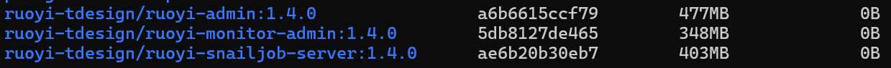

# 在Linux中使用docker部署

## 先决条件
执行docker命令需要安装docker<br/>
windows平台安装Docker Desktop<br/>
macOS/Linux平台使用命令安装docker即可

## 执行打包Docker镜像命令


windows 平台执行docker_build.bat
linux 平台执行docker_build.sh



选择要打包镜像的服务，打包镜像之前需要先执行jar打包（此处请参考手动部署中的编译章节），确保完成package后再执行脚本

镜像打包依赖基础bellsoft/liberica-openjdk-debian:17.0.11-cds镜像，当前由于docker.io无法被正常访问，因此请使用代理进行下载
::: tip
没有代理的话可以使用我分享的文件下载到本地哦<br/>
通过网盘分享的文件：liberica-openjdk-debian_17.0.11-cds.tar<br/>
链接: https://pan.baidu.com/s/1ah18Hmwm19eLTd7zj7kp2w?pwd=c2b5 提取码: c2b5<br/>

然后执行加载本地镜像文件，这样就不需要使用代理进行下载了<br/>
```docker
docker load -i liberica-openjdk-debian_17.0.11-cds.tar
```
:::

## 上传镜像
这里的所有镜像也都需要上传到服务器中，上传方式有两种<br/>
### 使用docker push上传
windows平台修改insecure-registries配置，添加私服的地址，格式是`ip:port`<br/>



Linux平台，修改`/etc/docker/daemon.json`文件，添加如下内容
```json
{
  "insecure-registries": [
    "192.168.1.100:5000" // 此处替换成你的私服地址
  ]
}
```
登录docker 私服
```docker
docker login 192.168.1.100:5000
# 输入用户名密码
```
登录成功后，就可以使用docker push命令上传镜像了，但在此之前我们需要先修改镜像的tag<br/>
```docker
docker tag bellsoft/liberica-openjdk-debian:17.0.11-cds 192.168.1.100:5000/bellsoft/liberica-openjdk-debian:17.0.11-cds
```
push镜像，正常来说到这里就结束了
```docker
docker push 192.168.1.100:5000/bellsoft/liberica-openjdk-debian:17.0.11-cds
```

### 使用docker save上传
使用save主要是为了解决内网环境下无法使用网络的方式push，另外一种原因是没有镜像仓库<br/>

运行docker save命令，将镜像保存到本地文件中，保存的位置就是执行`docker save`命令的目录中<br/>
```docker
docker save bellsoft/liberica-openjdk-debian:17.0.11-cds > bellsoft-liberica-openjdk-debian_17.0.11-cds.tar
```
自行使用scp命令将文件上传到服务器中或者XFTP等工具上传文件到服务器中<br/>
运行docker load命令，将镜像加载到本地中<br/>
```docker
docker load -i bellsoft-liberica-openjdk-debian_17.0.11-cds.tar
# 或者使用
docker load < bellsoft-liberica-openjdk-debian_17.0.11-cds.tar
```

## 准备Docker环境
打包完成后我们可以使用`docker images`来列出所有镜像


这里还需要准备数据库、redis、nginx、minio（可选）的镜像
### 下载MySQL镜像
```docker
docker pull mysql:8.0.33
```
::: tip
通过百度网盘分享的文件：mysql_8.0.33.tar<br/>
链接: https://pan.baidu.com/s/10UPK2m3ckNwM3z82_Oo89A?pwd=ipuj
提取码: ipuj
:::
### 下载redis镜像
```docker
docker pull redis:latest
```
::: tip
通过百度网盘分享的文件：redis_latest.tar<br/>
链接：https://pan.baidu.com/s/1jioJUtbPUez3d2c7ZmvcgA?pwd=88m7
提取码：88m7
:::
### 下载nginx镜像
```docker
docker pull nginx:latest
```
::: tip
通过百度网盘分享的文件：nginx_latest.tar<br/>
链接：https://pan.baidu.com/s/1h5JA-aaOti3lQwVLoQrTvA?pwd=88m7
提取码：88m7
:::
### 下载minio镜像
```docker
docker pull minio/minio:RELEASE.2023-04-13T03-08-07Z
```
::: tip
通过百度网盘分享的文件：minio_RELEASE_2023-04-13T03-08-07Z.tar<br/>
链接：https://pan.baidu.com/s/10pMTcrUwRdbCXlnr0l9lYw?pwd=88m7
提取码：88m7
:::

### 创建网络
```docker
docker network create ruoyi-tdesign-net
# 查看创建的网络
docker network ls
```

### 运行Docker容器

正在建设中...
