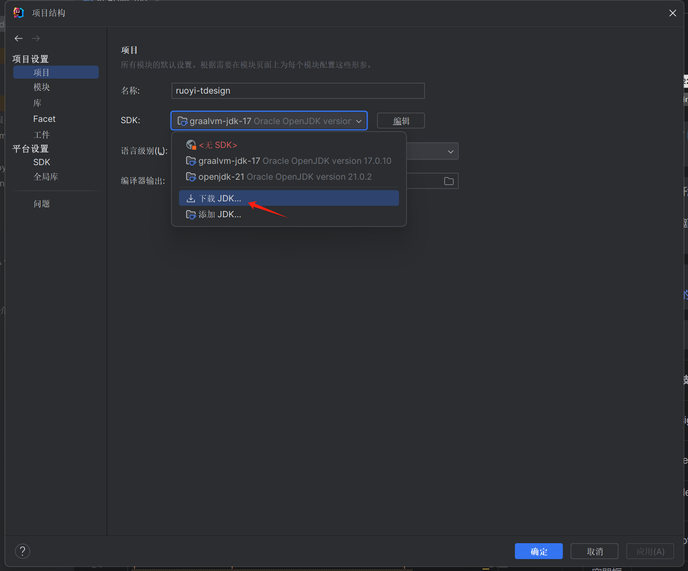
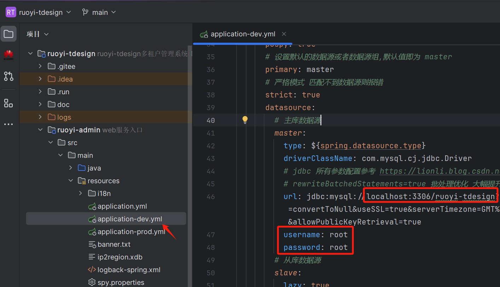
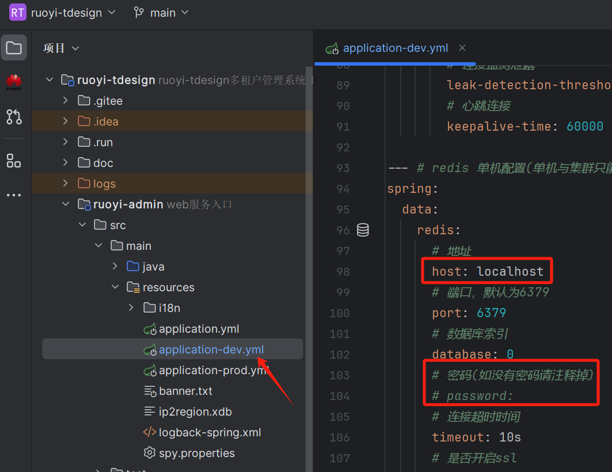
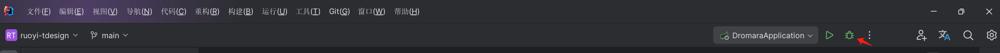
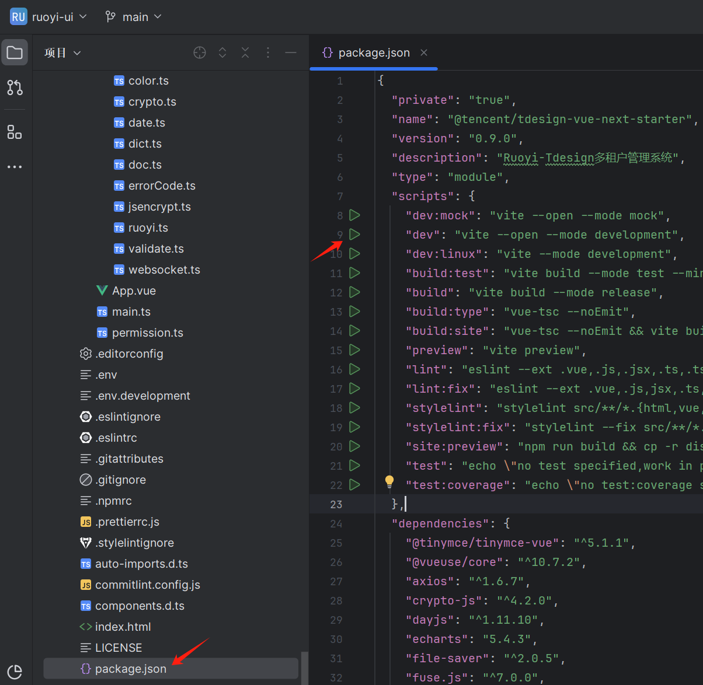

# 在开发环境中运行

## 一、准备后端开发工具

1. 下载IntelliJ IDEA
    ::: tip
    IntelliJ IDEA是java编程语言的集成开发环境。IntelliJ在业界被公认为最好的Java开发工具，尤其在智能代码助手、代码自动提示、重构、JavaEE支持、各类版本工具(git、svn等)、JUnit、CVS整合、代码分析、 创新的GUI设计等方面的功能。
    :::
    下载地址：https://www.jetbrains.com/zh-cn/idea/download/
2. 在 `file > open` 中打开下载好的项目文件根目录[`ruoyi-tdesign`](https://github.com/ruoyi-tdesign/ruoyi-tdesign/archive/refs/heads/main.zip)。或者使用Git拉取项目
3. 在 `file > settings(Ctrl+Alt+S)`打开设置，在设置中搜索Maven，设置maven的根目录或者直接使用绑定的maven，设置自定义的配置文件，推荐使用阿里云仓库  
    Maven官网（apache-maven-3.x-bin.zip）：https://maven.apache.org/download.cgi  
    阿里云仓库配置
    ```xml
    <mirror>
     <id>aliyunmaven</id>
     <mirrorOf>*</mirrorOf>
     <name>阿里云公共仓库</name>
     <url>https://maven.aliyun.com/repository/public</url>
    </mirror>
    ```
   重新加载（刷新maven）后等待maven下载完成

4. 使用快捷键 `Ctrl+Alt+Shift+S` 打开项目结构，选择`项目（Project）> SDK`
   
    选择下载好的sdk，推荐使用openJdk或者graalvmJDK的17或21版本  
    此处选择的版本应该与根目录下的 `pom.xml > java.version` 中配置的版本一致  

## 二、准备前端开发工具
1. 安装WebStorm或者直接使用IntelliJ IDEA、或者安装Visual Studio Code。三选一即可  
    - WebStorm：https://www.jetbrains.com/webstorm/  
    - Visual Studio Code：https://code.visualstudio.com/

2. 下载NodeJS  
    **选择以下两种方式其中之一：**  
    - 多个Node版本管理(推荐)：https://github.com/coreybutler/nvm-windows/releases  
    - NodeJS：https://nodejs.org/en

3. 如果使用nvm管理多个node版本(可能需要管理员权限)。(可选)  
    安装完成之后，使用例如：`nvm install 18.12.1`的方式安装node  
    - 安装nodejs：`nvm install xxx`  
    - 卸载nodejs: `nvm uninstall xxx`  
    - 使用指定版本的nodejs： `nvm use xxx`  
    - 安装的所有nodejs：`nvm list`

4. 安装nrm(可选)
   ```shell
   npm install -g nrm
   ```
    使用nrm管理仓库来源镜像  
    - 所有镜像：`nrm ls`  
    - 使用指定镜像： `nrm use npm`

5. 使用WebStorm或IntelliJ IDEA或Visual Studio Code打开 `ruoyi-tdesign > ruoyi-ui`。  
    在根路径下执行命令：  
    ```shell
   yarn install
   ```

## 三、安装Mysql（Oracle、PostgreSQL）
- Mysql: https://dev.mysql.com/downloads/installer/  
- Oracle: https://www.oracle.com/cn/downloads/  
- PostgreSQL: https://www.postgresql.org/download/  
- 若使用Mysql请导入项目根目录下的`script/sql/ry_vue_1.X.sql`脚本  
- 若使用Oracle请导入项目根目录下的`script/sql/oracle/oracle_ry_vue_1.X.sql`脚本  
- 若使用PostgreSQL请导入项目根目录下的`script/sql/postgres/postgres_ry_vue_1.X.sql`脚本  

## 四、安装Redis
Redis-windows: https://github.com/tporadowski/redis/releases  
双击redis-server启动服务

## 五、在开发模式下运行
以上环境准备完成后，我们就可以启动项目。
1. 首先配置数据库与Redis  
    - 数据库配置：
    
    - Redis配置：
    
2. 启动后端Admin监控服务（非必要）  
    启动类位置：`ruoyi-extend/ruoyi-monitor-admin/src/main/java/org/dromara/monitor/admin/MonitorAdminApplication.java`
3. 启动PowerJob定时任务启动类（非必要）  
    - 修改`ruoyi-extend/ruoyi-powerjob-server/src/main/resources/application-dev.properties`文件中的数据库配置
    - 确保数据库已经导入了`powerjob.sql`脚本文件
    - 启动类位置：`ruoyi-extend/ruoyi-powerjob-server/src/main/java/org/dromara/powerjob/PowerJobServerApplication.java`
    
4. 启动后端主程序开发环境  
    如需要Admin监控服务或PowerJob服务，需要先启动，并在`ruoyi-admin/src/main/resources/application-dev.yml`中开启对应的开关  
    启动后台系统：
    
5. 启动前端开发环境  
    点击dev左边的绿色按钮
    
    或者使用`npm run dev`命令运行
