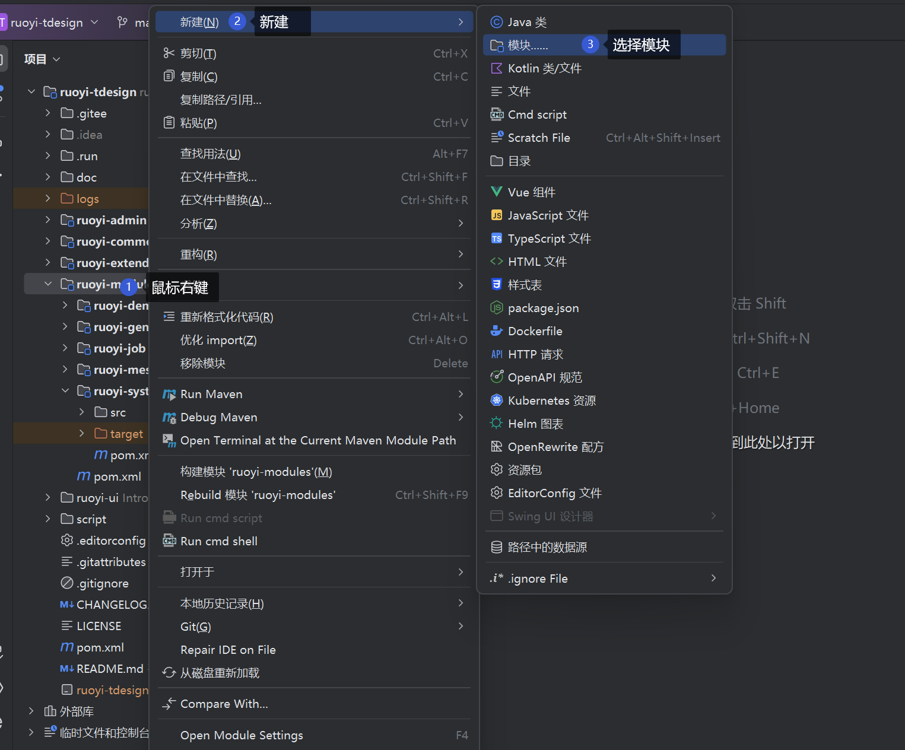
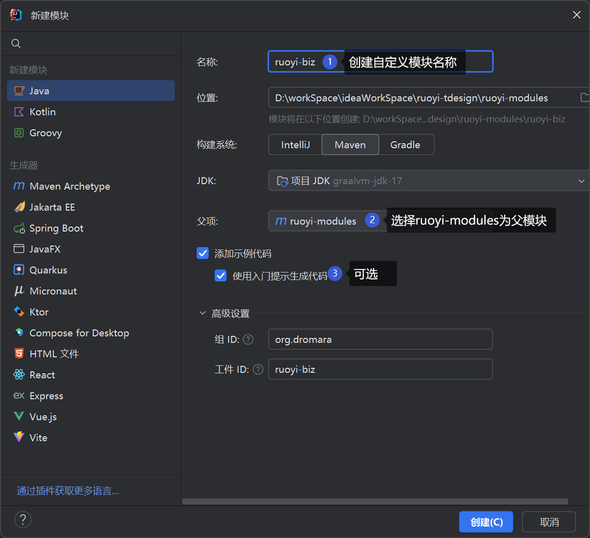

# 创建新模块

* 参考ruoyi-demo模块
* 需要改动: 父pom 与 admin模块pom

## 使用IDEA工具创建模块





## 需要改动的pom文件

:::code-group
```xml [ruoyi-biz/pom.xml]
<?xml version="1.0" encoding="UTF-8"?>
<project xmlns="http://maven.apache.org/POM/4.0.0"
         xmlns:xsi="http://www.w3.org/2001/XMLSchema-instance"
         xsi:schemaLocation="http://maven.apache.org/POM/4.0.0 http://maven.apache.org/xsd/maven-4.0.0.xsd">
    <modelVersion>4.0.0</modelVersion>
    <parent>
        <groupId>org.dromara</groupId>
        <artifactId>ruoyi-modules</artifactId>
        <!-- 此处版本号改为${revision}，跟随主版本 -->
        <version>${revision}</version>
    </parent>

    <artifactId>ruoyi-biz</artifactId>

    <description>
        业务模块
    </description>

    <dependencies>
        <!-- 引入system模块，也可以将system模块的依赖复制过来 -->
        <dependency>
            <groupId>org.dromara</groupId>
            <artifactId>ruoyi-system</artifactId>
        </dependency>
    </dependencies>
</project>
```
```xml {18-19} [ruoyi-modules/pom.xml]
<?xml version="1.0" encoding="UTF-8"?>
<project xmlns="http://maven.apache.org/POM/4.0.0"
         xmlns:xsi="http://www.w3.org/2001/XMLSchema-instance"
         xsi:schemaLocation="http://maven.apache.org/POM/4.0.0 http://maven.apache.org/xsd/maven-4.0.0.xsd">
    <modelVersion>4.0.0</modelVersion>
    <parent>
        <groupId>org.dromara</groupId>
        <artifactId>ruoyi-tdesign</artifactId>
        <version>${revision}</version>
    </parent>

    <modules>
        <module>ruoyi-demo</module>
        <module>ruoyi-generator</module>
        <module>ruoyi-job</module>
        <module>ruoyi-system</module>
        <module>ruoyi-message</module>
        <!-- 新增的模块包 -->
        <module>ruoyi-biz</module>
    </modules>

    <artifactId>ruoyi-modules</artifactId>
    <packaging>pom</packaging>

    <description>
        ruoyi-modules 业务模块
    </description>

</project>
```
```xml {15-20} [ruoyi-tdesign/pom.xml]
<?xml version="1.0" encoding="UTF-8"?>
<project xmlns="http://maven.apache.org/POM/4.0.0"
         xmlns:xsi="http://www.w3.org/2001/XMLSchema-instance"
         xsi:schemaLocation="http://maven.apache.org/POM/4.0.0 http://maven.apache.org/xsd/maven-4.0.0.xsd">
    <modelVersion>4.0.0</modelVersion>

    <groupId>org.dromara</groupId>
    <artifactId>ruoyi-tdesign</artifactId>
    <version>${revision}</version>

    <!-- 依赖声明 -->
    <dependencyManagement>
        <dependencies>

            <!-- 将新模块加入依赖版本管理中，这样其他包就不需要再指定版本了 -->
            <dependency>
                <groupId>org.dromara</groupId>
                <artifactId>ruoyi-biz</artifactId>
                <version>${revision}</version>
            </dependency>

        </dependencies>
    </dependencyManagement>
</project>
```
```xml {20-24} [ruoyi-admin/pom.xml]
<?xml version="1.0" encoding="UTF-8"?>
<project xmlns="http://maven.apache.org/POM/4.0.0"
         xmlns:xsi="http://www.w3.org/2001/XMLSchema-instance"
         xsi:schemaLocation="http://maven.apache.org/POM/4.0.0 http://maven.apache.org/xsd/maven-4.0.0.xsd">
    <parent>
        <artifactId>ruoyi-tdesign</artifactId>
        <groupId>org.dromara</groupId>
        <version>${revision}</version>
    </parent>
    <modelVersion>4.0.0</modelVersion>
    <packaging>jar</packaging>
    <artifactId>ruoyi-admin</artifactId>

    <description>
        web服务入口
    </description>

    <dependencies>

        <!-- 将新的模块加入到后台管理依赖中 -->
        <dependency>
            <groupId>org.dromara</groupId>
            <artifactId>ruoyi-biz</artifactId>
        </dependency>

    </dependencies>

</project>

```
:::

## 注意事项

如果是两个不同包名的模块 需要修改如下配置 <br>
找到模块 `ruoyi-admin` 里面的配置文件 `application.yml` 修改高亮位置如下： <br>

```yaml {6-7,11-12}
# MyBatisPlus配置
# https://baomidou.com/config/
mybatis-plus:
  # 不支持多包, 如有需要可在注解配置 或 提升扫包等级
  # 例如 com.**.**.mapper
  #mapperPackage: org.dromara.**.mapper
  mapperPackage: org.**.**.mapper # 修改扫描bean路径
  # 对应的 XML 文件位置
  mapperLocations: classpath*:mapper/**/*Mapper.xml
  # 实体扫描，多个package用逗号或者分号分隔
  #  typeAliasesPackage: org.dromara.**.domain
  typeAliasesPackage: org.dromara.**.domain,com.xxx.**.domain
```

修改启动程序 `DromaraApplication` 扫描包路径：
```java {6}
/**
 * 启动程序
 *
 * @author ruoyi
 */
@SpringBootApplication(scanBasePackages = {"org.dromara", "com.xxx"}) // 原来的包路径 + 新的包路径
public class DromaraApplication {

    public static void main(String[] args) {
        SecureUtil.disableBouncyCastle();
        SpringApplication application = new SpringApplication(DromaraApplication.class);
        application.setApplicationStartup(new BufferingApplicationStartup(2048));
        application.run(args);
        System.out.println("(♥◠‿◠)ﾉﾞ  ruoyi-tdesign启动成功   ლ(´ڡ`ლ)ﾞ");
    }

}
```
