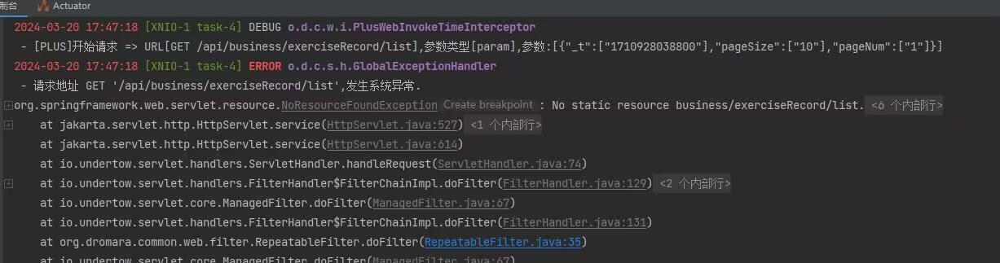

# 常见问题

::: tip
这个 FAQ 假定你已经有一些使用 Springboot 和 Vue 的开发经验。
:::

**目录：**
[[toc]]

## Jdk17 TLS问题

> JDK17需要到jdk/conf/security目录文件下，删除jdk.tls.disabledAlgorithms中的TLSv1, TLSv1.1限制

删除前：
```text
jdk.tls.disabledAlgorithms=SSLv3, TLSv1, TLSv1.1, RC4, DES, MD5withRSA, \
   DH keySize < 1024, EC keySize < 224, 3DES_EDE_CBC, anon, NULL
```
删除后:
```text
jdk.tls.disabledAlgorithms=SSLv3, RC4, DES, MD5withRSA, \
  DH keySize < 1024, EC keySize < 224, 3DES_EDE_CBC, anon, NULL
```

## 未能读取到有效Token（登录状态已过期）

由于使用了单项目多用户配置的原因，需要在 `application.yml` 文件中加入自定义的url用来对应不同用户对应需要检验的url
```yaml
sa-token:
  multiple:
    login:
      match:
        - /tool/gen/**
        - /auth/**
        - /system/**
        - /monitor/**
        - /resource/**
        - /demo/**
```

## 租户套餐修改后，权限没有变化

租户套餐修改关联的菜单后，需要点击同步套餐按钮，同步到租户中
::: tip
v1.1.0版本 已支持租户套餐变更后，同步到所有租户上
:::

## 前端在切换导航时会偶发空白页的问题

1. 组件名称重复会导致页面空白（概率最高）
2. 与HTML预定义的组件名称相同（例如：Menu、Table）
3. 存在多个根组件（可能导致，不一定）
4. 代码报错
5. 代码热更新后，切换到其他页面会白屏（刷新页面）

## 读取不到租户

### 场景一：定时任务
由于定时任务无携带任何租户信息，也无需租户标识，调用需要租户的函数会导致读取不到租户后报错。此时应该在定时任务中标识 `@IgnoreTenant` 注解
```java
public @interface IgnoreTenant {
    /**
     * 对事务生效
     */
    boolean db() default true;
    /**
     * 对缓存生效，效果与使用全局缓存一致
     * 全局缓存使用{@link org.dromara.common.core.constant.GlobalConstants#GLOBAL_REDIS_KEY}或设置该参数为true
     */
    boolean cache() default false;
}
```
在定时任务中使用
```java
@Component
public class BizJobs {

    /**
     * 每分钟执行任务
     */
    @IgnoreTenant
    @EventListener
    public void everyMinute(EveryMinuteJobEvent jobEvent) {
        // 业务代码
    }
}

```
:::tip
`IgnoreTenant#cache` 并不建议开启，因为在租户中与忽略租户中的缓存key并不相同，因此如果有需要保持一致的情况下，应该使用全局缓存而不是忽略它们之间的差异
:::

### 场景二：消息队列
消息队列可以在发送消息时携带租户信息，那么建议使用动态租户的方式<br/>
我们以 `ruoyi-common-amqp` 依赖为例
```java
@Service
public class BizServiceImpl
    @Autowired
    private AmqpTransactionalTemplate amqpTransactionalTemplate;

    @Transactional(rollbackFor = Exception.class)
    public void demo() {
      // 业务消息类继承该类即可
      TenantMQMessage message = new TenantMQMessage();
      amqpTransactionalTemplate.convertAndSend(BizAmqpExchange.SEND_TEST, message).commit();
    }
}
```
消费端使用 `@DynamicTenant` 注解, `#msg.tenantId` 是一个SpEL表达式，从`TenantMQMessage`对象中获取 `tenantId` 属性值作为租户id
```java
@Component
public class BizReceiver {

    // 1.2.0及以下版本请使用 #{#msg.tenantId} 写法
    @DynamicTenant(value  = "#msg.tenantId")
    @RabbitListener(bindings = @QueueBinding(
            value = @Queue(value = BizAmqpExchange.SEND_TEST_QUEUE),
            exchange = @Exchange(value = BizAmqpExchange.SEND_TEST, type = ExchangeTypes.FANOUT)
    ))
    public void test(TenantMQMessage msg) {
        // 业务代码
    }
}
```
::: tip
1.2.0及以下版本请使用 `#{#msg.tenantId}` 写法，1.2.0以上版本使用 `#msg.tenantId`<br/>
在非web环境下，需要包装到 `TenantHelper.ignore` 中执行或使用 `@DynamicTenant` 注解中读取租户
:::
### 场景三：无需登录的页面访问

用户自身携带租户标识，因此进入需要授权的页面时，能够读取用户绑定的租户。

但非授权页面，例如客户端首页，小程序首页等无需登录即可访问的页面，由于没有用户信息，因此后端读取不到租户id。

此时可以使用租户管理下的租户应用管理，在请求头中携带X-APP-KEY，可以路由到指定的租户下。这个key可以是一个域名、appid等任何可以标识用户租户身份的值。

进入 `租户管理 > 租户应用管理` 新建应用管理。该应用绑定当前登录用户的租户，不同租户映射不同的多个应用。


::: tip
应用key即使在不同租户下也不能重复
:::

## bean of type 'XXXMapper' that could not be found.导致启动报错 

例如以下报错信息：

::: details 报错信息
```java
***************************
APPLICATION FAILED TO START
***************************

Description:

Parameter 0 of constructor in org.dromara.system.service.impl.SysTenantServiceImpl required a bean of type 'org.dromara.system.mapper.SysUserMapper' that could not be found.

The injection point has the following annotations:
	- @org.springframework.beans.factory.annotation.Autowired(required=true)


Action:

Consider defining a bean of type 'org.dromara.system.mapper.SysUserMapper' in your configuration.
```
:::


此时可以排查在 `ruoyi-common` 文件夹下是否多出一个 `target` 目录，该目录会导致启动报错

修复步骤： 使用maven clean > 重新加载Maven项目（刷新maven） > 重新启动项目(重新编译)


## No static resource biz/xxx/list.



这个错误说明的意思是你的接口不存在，并且也不存在这个静态资源。

很明显，你的接口所在的模块没有引入到启动类模块中。
